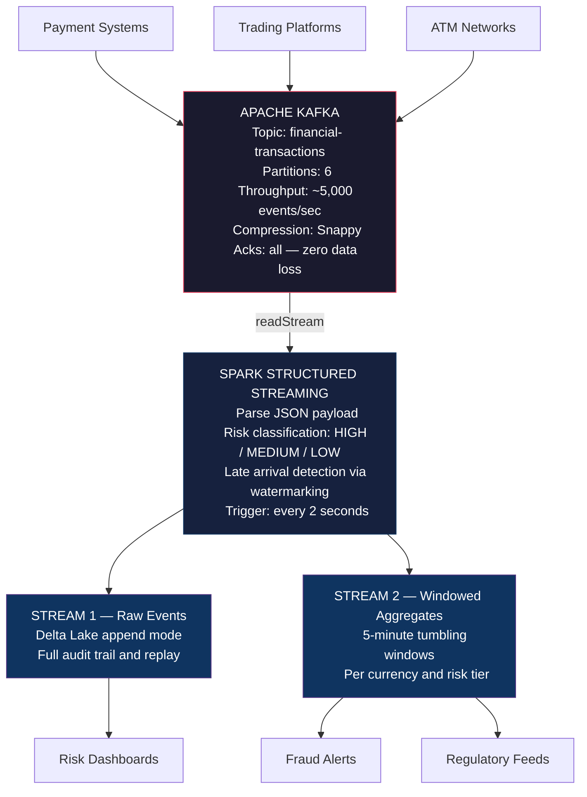
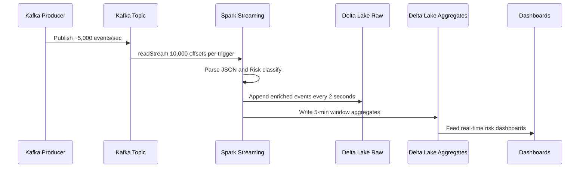

# Real-Time Financial Event Streaming — Kafka → Spark → Delta Lake

<div align="center">


**High-throughput, fault-tolerant real-time pipeline ingesting ~5,000 financial transaction events/sec from Kafka into Delta Lake with exactly-once semantics.**

</div>

---

## Architecture



---

## Pipeline Flow



---

## Project Structure

```
kafka-streaming/
│
├── producer/
│   └── transaction_producer.py     # Simulates ~5,000 events/sec
│
├── spark_streaming/
│   └── streaming_pipeline.py       # Kafka → Spark → Delta Lake
│
├── config/
│   └── docker-compose.yml          # Local Kafka + Zookeeper + UI
│
└── README.md
```

---

## Key Features

| Feature | Detail |
|---|---|
| Throughput | ~5,000 events/sec |
| Fault tolerance | Checkpointing — restarts from last offset |
| Exactly-once | Delta Lake idempotent writes |
| Late data handling | 10-minute watermark |
| Risk classification | HIGH / MEDIUM / LOW tiers inline |
| Windowed aggregates | 5-minute tumbling windows per currency |
| Local dev | Full Docker Compose setup included |

---

## Scale and Performance

| Metric | Value |
|---|---|
| Events per second | ~5,000 |
| Micro-batch trigger | Every 2 seconds |
| Watermark for late data | 10 minutes |
| Window size | 5 minutes |
| Kafka partitions | 6 |

---

## Quickstart

```bash
# 1. Start Kafka locally using Docker
cd config
docker-compose up -d

# Kafka UI available at http://localhost:8080

# 2. Install dependencies
pip install pyspark delta-spark kafka-python

# 3. Start the Spark consumer first
python spark_streaming/streaming_pipeline.py

# 4. In a new terminal start the producer
python producer/transaction_producer.py
```

---

## Sample Output

```
Stream 1 — Raw enriched events:
transaction_id        customer_id    amount     risk_tier
a3f2c1d4-...          CUST_52841     142.50     LOW
b8e1a2f3-...          CUST_71023     10500.00   HIGH

Stream 2 — 5-minute windowed aggregates:
window              currency   risk_tier   count    total_amount
10:00 to 10:05      USD        LOW         12,847   847,293.22
10:00 to 10:05      USD        HIGH           203   2,847,500.00
```

---

## Tech Stack

| Component | Tool |
|---|---|
| Message broker | Apache Kafka 3.5 |
| Stream processing | Spark Structured Streaming |
| Storage | Delta Lake |
| Language | Python and PySpark |
| Local setup | Docker and Docker Compose |
| Monitoring | Kafka UI at localhost:8080 |

---

## Author

**Sujith Reddy Manne** — Senior Data Engineer

[](https://www.linkedin.com/in/sujith-reddy-manne)
[](mailto:sujith.data012@gmail.com)

AWS Certified Solutions Architect · M.S. Computer Science (GPA 3.9/4.0)
