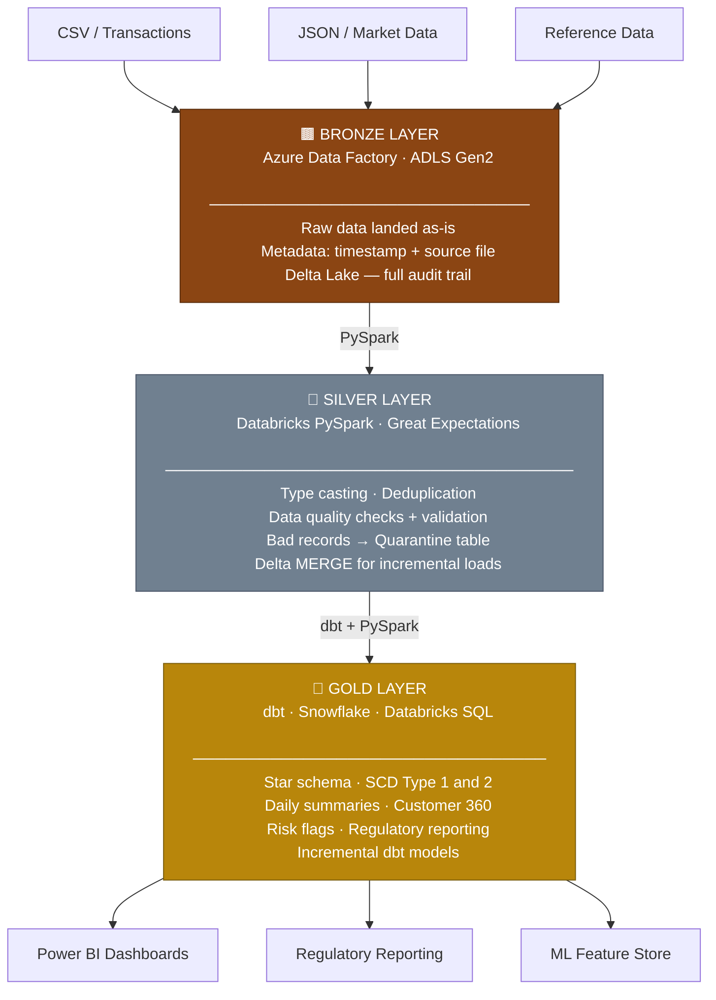
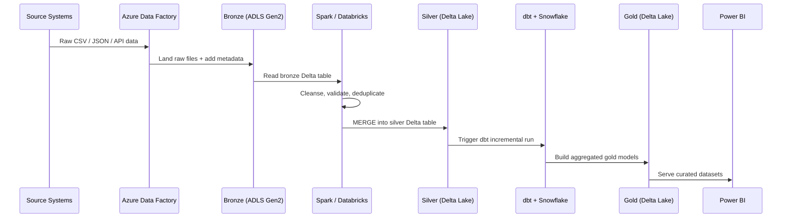

# Financial Data Lakehouse — Medallion Architecture

<div align="center">


**A production-grade data lakehouse pipeline for financial services workloads.**
Processes raw transaction data through Bronze → Silver → Gold layers with automated
data quality validation, incremental loading, and regulatory-ready aggregations.

</div>

---

## Architecture



---

## Pipeline Flow



---

## Project Structure

```
data-engineering-portfolio/
│
└── medallion-pipeline/
    │
    ├── bronze/
    │   └── ingest_raw.py              # Ingest raw data → Delta bronze table
    │
    ├── silver/
    │   └── transform_silver.py        # Cleanse, validate, upsert → Delta silver
    │
    ├── gold/
    │   └── build_gold.py              # Aggregations → Delta gold tables
    │
    ├── dbt_models/
    │   └── models/
    │       ├── staging/
    │       │   └── stg_transactions.sql
    │       ├── marts/
    │       │   └── fct_daily_transaction_summary.sql
    │       └── schema.yml             # Data quality tests
    │
    └── README.md
```

---

## Key Features

| Feature | How it's implemented |
|---|---|
| Incremental loads | Delta Lake MERGE + dbt incremental models |
| Data quality | Great Expectations + dbt schema tests |
| Bad record handling | Quarantine table — records never silently dropped |
| Idempotency | All pipelines are safe to re-run |
| Schema evolution | `mergeSchema: true` on all Delta writes |
| Full audit trail | Bronze immutability + Delta time travel |
| Compliance | RBAC + column masking + data lineage |

---

## Scale & Performance

| Metric | Value |
|---|---|
| Daily data volume | ~1 TB / day |
| Datasets processed | 40+ |
| Query latency improvement | 25% (Hadoop → Databricks migration) |
| dbt test coverage | 18 / 18 passing |
| Bad record rate | < 0.5% (quarantined, not dropped) |

---

## Quickstart

```bash
# Clone the repo
git clone https://github.com/sujithdata012-code/data-engineering-portfolio.git
cd medallion-pipeline

# Install dependencies
pip install pyspark delta-spark great-expectations dbt-snowflake

# Run the pipeline layers in order
python bronze/ingest_raw.py
python silver/transform_silver.py
python gold/build_gold.py

# Run dbt models and tests
cd dbt_models
dbt run
dbt test
```

---

## Tech Stack

| Layer | Tools |
|---|---|
| Ingestion | Azure Data Factory, Python |
| Processing | PySpark, Databricks |
| Storage | Delta Lake, ADLS Gen2 |
| Transformation | dbt, Snowflake |
| Orchestration | Apache Airflow |
| Data Quality | Great Expectations |
| CI/CD | Azure DevOps, Terraform, Docker |
| Visualization | Power BI |

---

## Author

**Sujith Reddy** — Data Engineer

[](https://www.linkedin.com/in/sujith-reddy-manne)
[](mailto:sujith.data012@gmail.com)

AWS Certified Solutions Architect · M.S. Computer Science (GPA 3.9/4.0)
